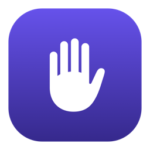
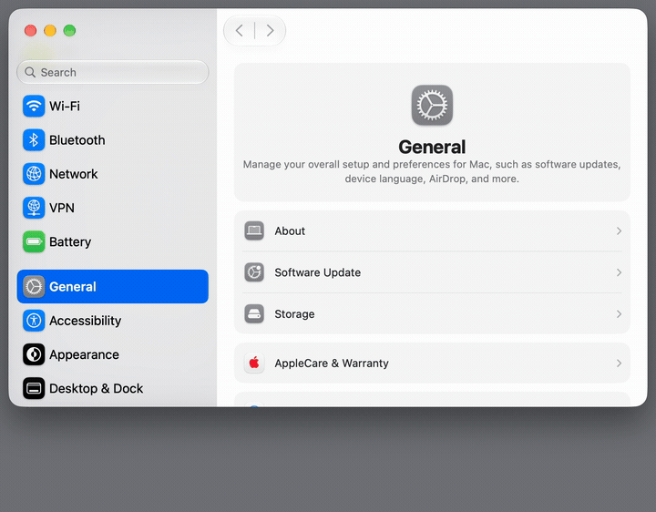
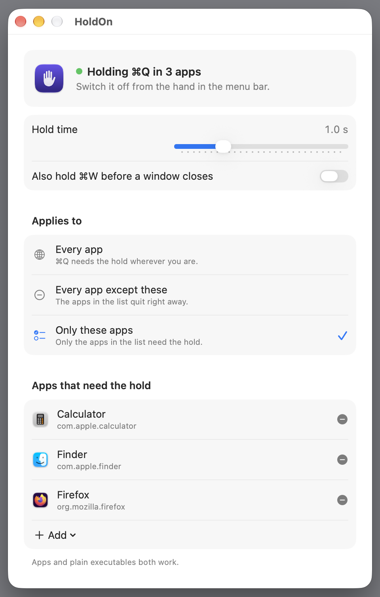

<div align="center">



# HoldOn

**A macOS menu bar app that makes ⌘Q require a short hold, so a mistyped shortcut never closes your work again.**

[](https://www.apple.com/macos/)
[](https://swift.org)
[](#build-from-source)
[](LICENSE)
[](https://github.com/qarge/HoldOn/releases)

</div>

---

## Why

⌘Q sits one key away from ⌘W, ⌘A and ⌘Tab. One slip and the editor, the browser or the
long-running tool you were working in is gone. HoldOn puts a deliberate pause in front of
it: tap ⌘Q and nothing happens, hold it and the app quits as usual.

## Demo

<div align="center">



*⌘Q is held, not tapped. Let go early and the app stays open.*

<br>



*Hold time, the ⌘W guard, and the apps the guard applies to.*

</div>

## Features

- **Hold to quit.** ⌘Q only goes through while you keep it held down, for a delay you pick.
- **⌘W too, optionally.** The same guard for closing windows and tabs, off by default.
- **Works beyond `.app` bundles.** A `java -jar` window, a Node or Python GUI, anything
  without a bundle identifier is protected by executable path or name.
- **Per-app scope.** Guard everything, everything except a list, or only a list.
- **Any keyboard layout.** Shortcuts resolve through the ASCII-capable layout, the same one
  macOS uses for menus, so the guard stays on while you type in a non-Latin layout.
- **Quiet HUD.** A small progress card at the bottom of the screen, nothing modal.
- **No network, no logging.** No update checks, no telemetry, no keystroke records.
- **Small and native.** Around 800 lines of Swift and SwiftUI, no dependencies, no Xcode project.

## Install

### Homebrew

```sh
brew install --cask qarge/tap/holdon
```

Or add the [tap](https://github.com/qarge/homebrew-tap) once and use the short name:

```sh
brew tap qarge/tap
brew trust qarge/tap      # Homebrew 6 and later, skip on older versions
brew install --cask holdon
```

Update with `brew upgrade --cask holdon`, remove with `brew uninstall --cask holdon`. Add
`--zap` to the uninstall to delete the settings too.

### Manual

Download the latest `.dmg` from [Releases](https://github.com/qarge/HoldOn/releases), open
it and drag **HoldOn** to Applications.

### First launch

macOS will ask for Accessibility access on first launch. Grant it in
**System Settings → Privacy & Security → Accessibility**. Nothing works without it: the app
has to see ⌘Q before your app does.

The app is signed but not notarized, so macOS blocks the very first launch. Confirm it once
with **Open Anyway** in **System Settings → Privacy & Security**.

One universal build covers Apple silicon and Intel, on macOS 14 Sonoma, 15 Sequoia,
26 Tahoe and 27.

## Build from source

```sh
git clone git@github.com:qarge/HoldOn.git
cd HoldOn
make install     # builds arm64 + x86_64, lipos them, copies to /Applications
```

| Target | What it does |
| --- | --- |
| `make` | builds the universal, signed `HoldOn.app` into `build/` |
| `make install` | the same, then copies it to `/Applications` |
| `make run` | installs and launches it |
| `make dev` | builds for this Mac's architecture only, installs and launches it, for a faster loop |
| `make test` | runs the tests with `swift test` |
| `make dist` | packages `dist/HoldOn-<version>.dmg` and `.zip`, and prints the zip checksum for the Homebrew cask |
| `make icon` | regenerates the app icon |

Signing uses the first Apple Development or Developer ID identity in your keychain, and
falls back to an ad-hoc signature if you have none.

### Editing

Open the repository folder, not a single file, in Zed, VS Code or Xcode. `Package.swift`
describes the sources for SourceKit-LSP, which gives completion, diagnostics and jump to
definition. The app itself is still built by `make`. In Zed, `task: spawn` lists ready tasks
to run, test and package the app.

## Usage

HoldOn has no Dock icon. It lives in the menu bar as a hand, filled while the guard is on
and outlined while it is off. The hand's menu turns the guard on and off, opens settings and
sets launch at login.

Settings open on their own the first time, and again whenever you open HoldOn from
Launchpad or Finder. A launch at login stays silent.

Settings carry the hold time, from 0.3 s to 3.0 s, on a slider or as a preset, the ⌘W guard,
and where the guard applies:

| Applies to | Meaning |
| --- | --- |
| Every app | every app has to be held |
| Every app except these | the listed apps quit right away |
| Only these apps | only the listed apps are held |

A list entry is either a bundle identifier or an absolute path. Add one from the running
apps, or point the file panel at any executable such as `/usr/bin/java`. Path entries also
match on the binary's name, so one entry covers every copy of that binary on the machine.

## Privacy

The event tap sees every keystroke of the session, which is what makes the guard possible,
so it is worth being precise: HoldOn reads the key code and the modifier flags, and passes
every event through untouched. Nothing is written to disk, nothing is logged, and the app
opens no network connections at all.

Settings live in `~/Library/Preferences/com.holdon.HoldOn.plist` and hold nothing but the
delay, the scope and the list you built.

## Acknowledgements

HoldOn is derived from [SlowQuit](https://github.com/dudukee/SlowQuit) by
[dudukee](https://github.com/dudukee), used under the MIT License. The original copyright
and license notice is kept in [NOTICE](NOTICE).

## License

HoldOn is released under the [GNU General Public License v3.0](LICENSE) or later,
© 2026 qarge. The portions derived from SlowQuit remain under the MIT License,
© 2025 dudukee, see [NOTICE](NOTICE).
